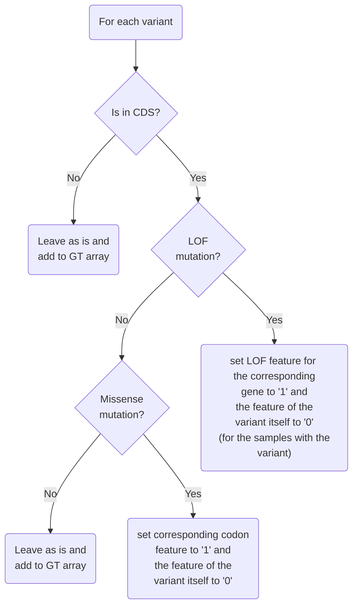
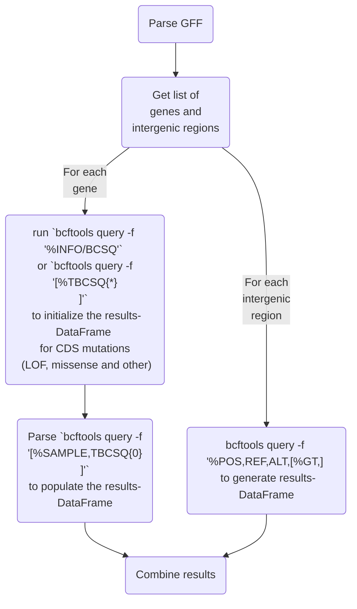

# Notes

## Overall

The aim is to leverage biological information to improve power in microbial GWAS
studies and phenotype prediction with machine learning by combining variants /
mutations with the same / highly similar impact. For example, burden testing
combines variants on the gene level (usually loss-of-function (LOF) mutations)
to find rare variants. Similarly, we could also combine all missense mutations
for each codon in a coding sequence. In general, it is necessary to strike a
balance between agglomerating enough information to improve power but not too
much as it would dilute the signal of causal variants.

For LOF and missense mutations the case is fairly straightforward:

* LOF: introduce an extra feature into the genotype (GT) matrix for each gene and set
it to one if there is a stop gained or non-restored frameshift in the first 70%
(or some other length) of the gene.
* Missense: combine missense mutations on the codon level

Note: When testing each feature individually, this is not an issue, but when
fitting certain models -- like linear regression without a sparsity-enforcing
penalty -- care needs to be taken in order to avoid introducing
multicollinearity. For example, variants could be set to zero in the GT
matrix if they flip a LOF or codon feature for a sample (or removed from the
GT matrix altogether).

For other CDS mutations though, waters get murky quickly. For example, how long
does a frameshift need to be before it is restored to be considered LOF or how
should we handle lost stop codons?

## General thoughts about the implementation

My first attempt to reconcile these issues is as follows:

* group variants into four categories and deal with them as follows:
  * non-coding mutations: leave as is and add to the GT matrix.
  * LOF mutations (early non-restored frameshifts and stops gained): add as
    extra features (on gene level) to the GT matrix and set to zero (the main
    reason for not removing them from the GT matrix is that frameshifts might be
    restored in some samples but not in others).
  * missense mutations: add to GT matrix (on codon level) and remove from the GT
    matrix (they can be removed since all combinations of mutations within a
    codon will be accounted for).
  * other mutations in coding sequences: leave as is and add to the GT matrix

Therefore, a program for constructing the feature matrix will need to do
something along these lines:

`bcftools query` will be used to extract (and pre-format) the information from
the `bcftools csq`-annotated VCF file before parsing it in Python (for the
prototype at least; we might try faster languages later if need be). The main
question with regards to the implementation then will be about how to implement
parallelization. Out of all the options, it seems the most sensible at this time
to query for each gene separately and process the CDS variants this way. Another
question is whether to parse the consequences first to initialize the `results`-
DataFrame or if it should rather be built incrementally while parsing the data.
Performance-wise, an initial pass is probably the better choice. It might also
make sense to do the initial pass separately for each gene as well. So, in brief,
`bcftools query -f '%INFO/BCSQ\n'` would be called for the regions corresponding
to each gene and parsed in search of LOF and missense mutations. These would be
added to the list of column names for the partial `results`-DataFrame alongside the
variants that fit neither category. IDs would be something like `LOF_$gene`,
`missense_$GeneCodonNum`, and `POS_REF_ALT` for the three groups, respectively.
Then, `bcftools query` query would be called again for the current gene (this
time with `-f '[%SAMPLE,TBCSQ{0}\n]'`) and the features would be set to `1` for
the relevant samples.

## Implementation strategy 1: gene-wise processing

A potential program achieving the functionality described above could look like this:

A potential complication is that `bcftools query -f '[%TBCSQ{0}\n]` ignores
samples with missing genotypes. On first glance, there are two ways of dealing
with this:

* Run another `bcftools` command to get the samples with missing genotypes and
  set the corresponding values in the GT matrix to `NaN`.
* Use `%BCSQ` instead of `TBCSQ{0}` in the query string and resolve the bitmask
  ourselves instead of letting `bcftools` do it.

| Pros of this approach  |  Cons of this approach |
|:---:|:---:|
| Straightforward parallelization by doing the   processing for different genes / intergenic regions   on different cores. | The user needs to provide the   GFF in addition to the `BCSQ`-annotated   VCF file. |
| Perhaps not as flexible as potential other   approaches (since it's relying on   certain assumptions like only one CDS   per gene etc.) | Need to make sure to detect + account   for all genes and intergenic regions   (including edge cases like overlapping   genes etc.)  |

## Implementation strategy 2: parallelize across samples rather than genes

This approach might be easier to implement and also does not require the user to
provide the GFF file. It might also perform similarly well. Again, there are
many design decisions to make. For now, we will stick with:

* Have a global `dict` for missense variants of the form `gene_AAnum_AA:`
  `[varString1, varString2, ...]` and a similar dict for LOF mutations with
  genes as keys
* Ignore consequences starting with `@` (i.e. downstream parts of compound-CSQs;
  the CSQ has already been handled / added to the dict and it is not necessary
  to deal with it again).
* For the later calls of `bcftools query`, use `[%GT:%BCSQ,]` instead of `[TBCSQ{0},]`
* Query the CSQs for a subset of samples and parse them. Ignore CSQs starting with `@`.
* In the sparse `results` DataFrame, have a row for each sample and a column per feature.

Stuff yet to decide / figure out:

* Whether initializing the `results` DataFrame is necessary since adding data to
  a sparse DataFrame might be performant enough.
